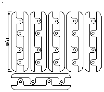

CFC - CAD for cases
===================

CAD for cases is a collection of tried and tested CAD files suitable for
manufacturing cases. Initially there is a strong focus both on cases for
[96Boards](https://96boards.org) products and for manufacturing in laser cut
acrylic.

Note that CAD for cases includes cases designed to conform to 96Boards
specifications but none are not official 96Boards products.

See [this blog post](http://www.redfelineninja.org.uk/daniel/?p=415) to
read about the genesis of CAD for cases.

Cases for 96Boards Consumer Edition
-----------------------------------

Sandwich-style cases, which are extremely easy to manufacture with a laser
cutter, are especially well suited as cases for [96Boards Consumer Edition][1].
The Consumer Edition boards have lots of connectivity options making open side
cases an attractive option. Additionally the specification allows additional
heat sinking to be added to the underside of the board which exceeds the 3.4mm
height limit. As it happens none of the announced boards take advantage of this
option so cases with side panels are still an interesting option for the
future.

[1]: https://www.96boards.org/products/ce/

 * [Simple case](96boards/ce_simple_case.dxf).
   This is a basic case for 96Boards Consumer Edition products. It
   consists of a single panel, 5mm larger on each side than the circuit
   board, that is suitable for use as either the top or bottom panel for
   a sandwich-style case. The panel has rounded corners and pre-cut
   mounting holes.

   

 * [100mm combo-case](96boards/ce_combo_case.dxf).
   This case is designed to fit into a 100x100mm panel, the smallest
   size offered by [Seeed Studio][2]). It contains the same cuts as the
   simple case, above, together with a second component that can be used
   as a half top. The half-top is offers much less protection to the
   main board but provides easy access to the LS connector and allows
   the [96Boards UART][3] to be fitted easily. The half-top is
   essentially a free bonus extra for cutting services with a 100x100mm
   minimum panel size.

   

 * [Side panels](96boards/ce_side_panel.dxf).
   These components can be stacked up to provide side panels for the
   case. If manufactured 2.5mm acrylic we need two underneath and three
   on top to get enough clearance to meet the spec. A 100x100 sheet
   yields 12 pieces although, in materials with a grain the yield will
   be 5 matched pairs plus 2 mismatched pieces (due to rotation to fit
   the last two components onto the panel).

   

   Be aware that the side panel components deviate somewhat from the
   physical specification. The spec. has a keep out radius of 2.5mm from
   the centre of the drill hole but, for strength, these components have
   a 3mm radius. Likewise the keep out area is strictly circular and
   does not extend to the edge of the PCB. Thus if the side panel
   components do not fit this does not imply the board is non-compliant.

[2]: http://www.seeedstudio.com/service/index.php?r=lasercutting
[3]: http://www.seeedstudio.com/depot/96Boards-UART-p-2525.html
